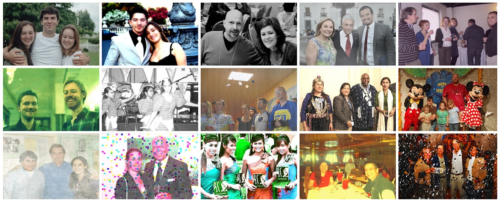

# 🕵🏻‍♂️ DLA DEEPFAKE DETECTION 2024/25 - UNICA
<div align="center">
  
  <p> Deepfake Detection Project using the OpenForensics dataset </p>
</div>

---
> ## 📑 Summary
> 1. [🧑🏻‍🎓 Students](#-students)
> 2. [📌 Description](#-description)
> 3. [📥 Download the Dataset](#-download-the-dataset)
> 4. [📄 Documentation](#-documentation)
> 5. [🚀 Installation](#-installation)
> 6. [🛠️ Test the DataLoader](#test-the-dataloader)
> 7. [🎯 Train the Model](#-train-the-model)
> 8. [📊 Evaluate the Model](#-evaluate-the-model)
> 9. [📂 Project Structure](#-project-structure)
> 10. [📊 Project Goals](#-project-goals)
> 11. [🤝 Contributions](#-contributions)
> 12. [🖥️ Hardware and Limitations](#hardware-and-limitations)

---

## 🧑🏻‍🎓 Students  
#### Francesco Congiu  
> Student ID: 60/73/65300  
>  
>> E-Mail: f.congiu38@studenti.unica.it  

#### Simone Giuffrida  
> Student ID: 60/73/65301  
>  
>> E-Mail: s.giuffrida2@studenti.unica.it  

#### Fabio Littera  
> Student ID: 60/73/65310  
> 
>> E-Mail: f.littera3@studenti.unica.it  

---

## 📌 Description  
This repository contains the code for training and evaluating deepfake detection models using the **OpenForensics** dataset. The project follows two approaches:  
1. **Transfer Learning** with pre-trained models (e.g., MobileNet, Xception).  
2. **Training from Scratch** with a custom neural network.  

---

## 📥 Download the Dataset  
The **OpenForensics** dataset required for the project can be downloaded from the following link:  
🔗 **[OpenForensics Dataset - Zenodo](https://zenodo.org/records/5528418)**  

---

## 📄 **Documentation**  
Below are links to the full project documentation:
- 📚 [Theoretical Background](documentation/BACKGROUND.md)
- 🛠 [Feature Extraction](documentation/FEATURE_EXTRACTION.md)
- 📊 [Metadata Analysis](documentation/METADATA_ANALYSIS.md)
- 🎯 [Fine Tuning of MobileNet and xCeption](documentation/FINE_TUNING.md)
- 🏗 [Building a Network from scratch](documentation/CUSTOM_NETWORK.md)

📂 **[Cartella con tutta la documentazione](documentation/)**

---

## 🚀 Installation  
To run the project locally, follow these steps:

### **1️⃣ Clone the Repository**  
Open the terminal and run:
```bash
git clone git@github.com:wakaflocka17/DLA_DEEPFAKEDETECTION.git
cd DLA_DEEPFAKEDETECTION
```
(Or, if using HTTPS)

```bash
git clone https://github.com/wakaflocka17/DLA_DEEPFAKEDETECTION.git
cd DLA_DEEPFAKEDETECTION
```

### **2️⃣ Create and Activate a Virtual Environment**
It is recommended to create a virtual environment to isolate dependencies:
```bash
python3 -m venv openforensics_env
source openforensics_env/bin/activate  # macOS/Linux
```
(On Windows, use: `openforensics_env\Scripts\activate`)

### **3️⃣ Install Dependencies**
Install all necessary libraries:
```bash
pip install -r requirements.txt
```

### **4️⃣ Set Up the Project Structure**
First, however, we make the script executable with the command:
```bash
chmod +x setup_folders.sh
```
Run the following script to create the required folders:
```bash
setup_folders.sh
```
This will create:
```plaintext
DLA_DEEPFAKEDETECTION/
│── data/
│   ├── Train/
│   ├── Val/
│   ├── Test-Dev/
│   ├── Test-Challenge/
│   ├── dataset/
│
│── processed_data/
│   ├── Train/
│   │   ├── real/
│   │   ├── fake/
│   ├── Val/
│   │   ├── real/
│   │   ├── fake/
│   ├── Test-Dev/
│   │   ├── real/
│   │   ├── fake/
│   ├── Test-Challenge/
│   │   ├── real/
```

### **5️⃣ Download the Dataset**
To automatically download the OpenForensics dataset, use the provided script:
```python
python3 scripts/download_dataset.py
```
💡 Ensure you have a stable internet connection, as the dataset is large (60GB+).

### **6️⃣ Move Images and JSON Files to Their Correct Directories**
Now that all files have been extracted, we need to organize them into the correct dataset folders (Train, Val, Test-Dev, Test-Challenge).
Run:
```python
python3 scripts/extract_dataset.py
```
💡 This will:
- Move **training images** to `data/Train/Train/` and the corresponding `Train_poly.json` to `data/Train/`.
- Move **validation images** to `data/Val/Val/` and `Val_poly.json` to `data/Val/`.
- Move **test-dev images** to `data/Test-Dev/Test-Dev/` and `Test-Dev_poly.json` to `data/Test-Dev/`.
- Move **test-challenge images** to `data/Test-Challenge/Test-Challenge/` and `Test-Challenge_poly.json` to `data/Test-Challenge/`.

### **7️⃣ Delete Unnecessary ZIP Files**
After extraction and organization, the original .zip files are no longer needed.
Delete them using:
```python
python3 scripts/delete_all_zips.py
```
💡 This will clean up the dataset directory, saving storage space.

### **8️⃣ Verify Installation**
To check if everything works correctly, run:
```bash
python3 -c "import torch; print(torch.__version__)"
python3 -c "import cv2; print(cv2.__version__)"
```
If no errors appear, the setup is complete! 🎯

---

## 🛠️ Test the DataLoader <a name="test-the-dataloader"></a>
Before training, verify that the dataset is correctly loaded:
```python
python3 scripts/dataloader.py --dataset Train --batch_size 32
```
💡 This should display a batch of `images` and `labels`.

## 🎯 Train the Model
Train the model using either `MobileNet` or `Xception`: <br> <br>
✅ Train with `MobileNet`:
```python
python3 scripts/train.py --model mobilenet
```
✅ Train with `Xception`:
```python
python3 scripts/train.py --model xception
```
✅ Train with `Custom network`:
```python
python3 scripts/train.py --model custom
```
💡 The trained model will be saved in the `models/` directory.

## 📊 Evaluate the Model
After training, evaluate the model on `Test-Dev` and `Test-Challenge`: <br> <br>
✅ Evaluate **MobileNet** on `Test-Dev`:
```python
python3 scripts/evaluate.py --model mobilenet --dataset Test-Dev
```
✅ Evaluate **MobileNet** on `Test-Challenge`:
```python
python3 scripts/evaluate.py --model mobilenet --dataset Test-Challenge
```
✅ Evaluate **Xception** on `Test-Dev`:
```python
python3 scripts/evaluate.py --model xception --dataset Test-Dev
```
✅ Evaluate **Xception** on `Test-Challenge`:
```python
python3 scripts/evaluate.py --model xception --dataset Test-Challenge
```
✅ Evaluate **Custom network** on `Test-Dev`:
```python
python3 scripts/evaluate.py --model custom --dataset Test-Dev
```
✅ Evaluate **Custom network** on `Test-Challenge`:
```python
python3 scripts/evaluate.py --model custom --dataset Test-Challenge
```
💡 The script will print **Accuracy**, **Precision**, **Recall**, and **F1-score**.

---

## 📂 Project Structure  
```plaintext
DLA_DEEPFAKEDETECTION/
│── data/               # Dataset OpenForensics (originale, non modificato)
│   ├── Train/          # Training Data
│   ├── Val/            # Evaluation Data
│   ├── Test-Dev/       # Test-Dev Data
│   ├── Test-Challenge/ # Test-Challenge Data
│   ├── dataset/        # How to save the original dataset
│
│── processed_data/     # Preprocessing output (cropped faces)
│   ├── Train/
│   │   ├── real/       # Real faces extracted from the training set
│   │   ├── fake/       # Fake faces extracted from the training set
│   ├── Val/
│   │   ├── real/       # Real faces extracted for evaluation
│   │   ├── fake/       # Fake faces extracted for evaluation
│   ├── Test-Dev/
│   │   ├── real/       # Real faces extracted for Test-Dev
│   │   ├── fake/       # Fake faces extracted for Test-Dev
│   ├── Test-Challenge/
│   │   ├── real/       # Real faces extracted for Test-Challenge
│   │   ├── fake/       # Fake faces extracted for Test-Challenge
│
│── documentation/      # Documentation, reports, extra material
│── models/             # Saved models (es. file .pth)
│── scripts/            # Scripts (training, preprocessing, ecc.)
│── notebooks/          # Jupyter Notebook for debugging and testing
│── utils/              # Generic utilities and support functions
│── requirements.txt    # Project dependencies
│── setup_folders.sh    # Script for automatic creation of folders
│── README.md           # Project documentation
```

## 📊 Project Goals
✅ **Face extraction** from images using bounding boxes.  
✅ **Binary classification (fake/real)** of extracted faces.  
✅ **Training with transfer learning** using MobileNet or Xception.  
✅ **Development of a custom CNN** for classification.

## 🖥️ Hardware and Limitations <a name="hardware-and-limitations"></a>
> [!NOTE]
> The experiments were performed on a MacBook Pro (2024) with the following specifications:
> - **Operating system**: macOS Sonoma;
> - **Processor**: Apple M4 Pro;
> - **GPU**: Apple integrated GPU (M4 Pro);
> - **RAM**: 32 GB (unified memory);

> [!WARNING]
> Due to the size and computational complexity of the dataset, it is possible that some experiments may be slower or
difficult to execute on systems with fewer resources or less performing hardware.

---

## 🤝 Contributions  
Feel free to contribute to the project! 💡

### 📌 How to Contribute
1. Fork the repository.
2. Create a new branch:
   ```bash
   git checkout -b new-feature
   ```
3. Commit your changes:
   ```bash
     git commit -m "Add new feature"
   ```
4. Push your changes:
   ```bash
     git push origin new-feature
   ```
6. Open a Pull Request on GitHub.


