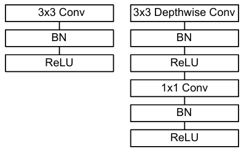

# 📚 1. THEORETHICAL BACKGROUND
## 1.1 Loss-function and optimization
In supervised learning, and particularly in image classification tasks, **the loss function and optimization method** form the basics of the training process. The loss function quantifies how well (or poorly) the network is performing by comparing its predictions to the true labels, while the optimizer describes how the model parameters should be updated to minimize this discrepancy. An appropriate choice of loss function and optimization algorithm is crucial: if the loss function is not aligned with the task’s objectives, the model may learn suboptimal patterns, and if the optimizer is inefficient or poorly tuned, training may take excessively long or fail to converge to a good solution. In deepfake detection, where the objective is to classify images (or frames) as real or fake, the cross-entropy loss is typically employed due to its effectiveness in multi-class and binary classification scenarios. Combined with an optimizer like Adam, which adaptively tunes individual learning rates for each parameter in the model, practitioners can achieve faster convergence and maintain stable training dynamics even when dealing with large-scale datasets or complex architectures.

### 1.1.1 Loss function: Cross-entropy
Cross-entropy loss, often referred to as softmax loss or log loss in classification contexts, is the standard choice for deep learning models aiming to distinguish between two or more classes. Formally, given a set of training examples $$(x_i, y_i)$$, where $$x_i$$ is the input (e.g., an image) and $$y_i$$ is the corresponding label (in one-hot or integer form), **the cross-entropy loss measures the dissimilarity between the predicted probability distribution $$\hat{y}_i$$ and the true distribution $$y_i$$.** For a single training example in a binary classification problem, the cross-entropy loss can be expressed as:

$$
L = - [ y \log(\hat{y}) + (1 - y)\log(1 - \hat{y})].
$$

In multi-class settings, $$\hat{y}$$ and $$y$$ become vectors representing the predicted and true probability distributions over the possible classes, and the loss is summed over all classes. This formulation effectively penalizes confident but wrong predictions by producing large gradient signals, helping to reduce misclassification errors. Cross-entropy aligns well with the probabilistic interpretation of classification, where each output neuron in the final layer corresponds to the logit for a specific class, and the softmax activation ensures that these logits sum to 1. Cross-entropy is almost universally adopted in many tasks regarding CNNs like deepfake detection, image recognition, and others.

### 1.1.2 Optimization: Adam 
Adam [Adam: A Method for Stochastic Optimization] stands for Adaptive Moment Estimation, its a popular stochastic optimization algorithm introduced by D. Kingma and J. Ba in 2014. It has become a standard in modern deep learning because of its ability to combine the benefits of two precedent optimizers: AdaGrad, which adapts the learning rate based on the frequency of parameter updates, and RMSProp, which normalizes the gradient by a moving average of its recent magnitudes. Specifically, Adam maintains exponentially decaying averages of past gradients (first moment) and their squares (second moment), allowing it to adjust the learning rate for each parameter dynamically. This feature is particularly beneficial in high-dimensional parameter spaces, where different parameters can exhibit vastly different gradient statistics. By mitigating the need to manually fine-tune separate learning rates, Adam often converges faster and more reliably than stochastic gradient descent (SGD), especially for architectures like MobileNet and Xception that can have millions of parameters. Adam’s sensitivity to hyperparameters (notably the learning rate and beta values controlling the exponential decay rates) means that a careful balance must still be struck to avoid overshooting or slow convergence. In deepfake detection pipelines, Adam’s adaptive nature helps stabilize training, allowing the model to quickly learn to recognize artifacts introduced by face-swapping or generative adversarial networks without getting stuck in local minimums.

## 1.2 Pre-trained network architectures: MobileNet e Xception
This section provides an overview of two custom neural networks, MobileNet and Xception, with specific attention regarding their architectures and underlying principles. Both architectures uses the concept of depthwise separable convolutions to obtain an optimal balance between computational efficiency and accuracy, although they were designed for different purposes and applications.

### 1.2.1 Mobilenet
MobileNet [MobileNets: Efficient Convolutional Neural Networks for Mobile Vision Applications Andrew G. Howard et Al.] is a suite of highly efficient convolutional neural network architectures specifically designed for mobile and embedded vision applications. Its key innovation is the use of depthwise separable convolutions—a type of factorized convolution that splits a standard convolution into two separate operations. In the first stage, the depthwise convolution applies a single filter to each input channel, effectively isolating channel-specific features. In the second stage, the pointwise convolution (a 1×1 convolution) combines these individual outputs to form a new set of features. This two-step process replaces the traditional one-step convolution that both filters and combines inputs, leading to a significant reduction in computational cost and model size without a substantial loss in accuracy.
The following image shows the difference between 
- Standard convolutional layer with batch norm and ReLU on the left.
- Depth wise Separable convolutions with Depthwise
 and Pointwise layers followed by batch norm and ReLU.

  

MobileNet distinguishes itself with its remarkable flexibility. It introduces two global hyperparameters—the width multiplier and the resolution multiplier—which allow developers to fine-tune the trade-off between accuracy, latency, and model size. This adaptability enables the network to be scaled down for resource-constrained environments while still maintaining competitive performance on tasks like image classification, object detection, and beyond.

### 1.2.2 Xception
Xception [Xception: Deep Learning with Depthwise Separable Convolutions Franc¸ois Chollet] is a convolutional neural network architecture that takes the idea of depthwise separable convolutions to its extreme. Instead of relying on complex inception modules, Xception completely decouples the learning of spatial and cross-channel correlations. This is done in two simple steps: first, a depthwise convolution independently extracts spatial features from each channel; then, a pointwise (1×1) convolution fuses these features across channels. This “extreme” formulation (hence the name Xception), short for “Extreme Inception”—leads to a more efficient use of parameters.
A convolution layer attempts to learn filters in a 3D space, with 2 spatial dimensions (width and height) and a channel dimension; thus a single convolution kernel is tasked with simultaneously mapping cross-channel correlations and spatial correlations. This idea behind the Inception module is to make this process easier and more efficient by explicitly factoring it into a series of operations that would independently look at cross-channel correlations and at spatial correlations. The typical Inception module first looks at cross channel correlations via a set of 1x1 convolutions, mapping  the input data into 3 or 4 separate spaces that are smaller than the original input space, and then maps all correlations in these smaller 3D spaces, via regular 3x3 or 5x5 convolutions.

  

  A canonical Inception module (Inception V3).

  

  An “extreme” version of our Inception module, with one spatial convolution per output channel of the 1x1 convolution.

### 1.2.3 Differences between the two models
1. Design Motivation and Target Use-Case:
   - MobileNets were primarily designed for mobile and embedded vision applications. They emphasize efficiency by trading off accuracy for lower latency and smaller model size, making them ideal for resource‐constrained environments.
   - Xception reinterprets the Inception module by taking the idea to its extreme. Its motivation is to fully decouple the mapping of spatial correlations from cross-channel correlations using depthwise separable convolutions, aiming for improved performance on large-scale image classification tasks. 
2. Architectural Composition:
   - MobileNets build their architecture almost entirely from depthwise separable convolutions and introduce two hyperparameters—the width multiplier and the resolution multiplier—to flexibly adjust the network’s size and computational cost. 
   - Xception replaces Inception modules with a linear stack of depthwise separable convolutions organized into deeper modules (36 convolutional layers grouped into 14 modules) and incorporates residual connections throughout. 
3. Order of Operations and Activation Placement
   - In MobileNets, each depthwise separable convolution is executed by first applying a depthwise (spatial) convolution and then a pointwise (1×1) convolution—with batch normalization and ReLU applied after each convolution—to capture both spatial and cross-channel correlations. 
   - Xception also uses depthwise separable convolutions but investigates a slightly different strategy: experimental results suggest that omitting the non-linearity (such as ReLU) between the depthwise and pointwise operations may actually yield faster convergence and better performance. This subtle change is part of its “extreme” interpretation of the Inception hypothesis. 
4. Use of Residual Connections
   - MobileNets do not incorporate residual (skip) connections in their basic architecture.
   - Xception makes extensive use of residual connections around its modules to help with training convergence and overall performance. 

These differences reflect the distinct goals of the two models: MobileNets are optimized for efficiency under tight computational constraints, while Xception leverages a more radical factorization of convolutions (with residual connections) to push performance on large-scale tasks.

An in depth view of how the Xception model can be used is seen in the paper done by R. Helaly et al. [https://ieeexplore.ieee.org/stamp/stamp.jsp?tp=&arnumber=9329302&isnumber=9329288]

## 1.3 Activation Functions in MobileNet, Xception, and CustomCNN
Activation functions play a crucial role in deep neural networks by introducing non-linearity, enabling models to learn complex patterns and relationships in data. They affect the model’s learning capacity and overall performance. In this section, we examine the activation functions used in MobileNet, Xception, and the CustomCNN.

### 1.3.1 Activation Function in MobileNet
MobileNet uses the ReLU (Rectified Linear Unit) activation function. Each depthwise and pointwise convolution operation in MobileNet is followed by Batch Normalization (BN) and a ReLU activation, this is used for:

 - Improving gradient flow: avoiding vanishing gradient problems that arise in deeper networks.
 - Efficient computations: the ReLU function is simple to compute
   
ReLU is defined as $$ReLU(x)=max(0,x)$$
it sets all negative inputs to zero while passing positive values unchanged. This simplicity contributes to the computational efficiency of MobileNet.

### 1.3.2 Activation Function in Xception
Xception also uses ReLU, but with a difference in its application compared to MobileNet:

Unlike MobileNet, Xception does not apply a non-linearity (ReLU) between the depthwise and pointwise convolutions.
This design decision is based on the hypothesis that depthwise convolution (which captures spatial correlations) and pointwise convolution (which captures cross-channel correlations) should be separately optimized without introducing additional non-linearity between them.
However, after each convolution block, Xception still uses Batch Normalization followed by ReLU, similar to MobileNet.
This difference contributes to faster convergence and better feature extraction.

### 1.3.3 Activation Function in CustomCNN
The CustomCNN defined by us also uses ReLU activation after the convolutional layer and batch normalization but before the max pooling operation, the sequence is:

 Convolutional layer → Batch normalization → ReLU → MaxPooling  

The ReLU activation function is also used after the first fully connected layer.
