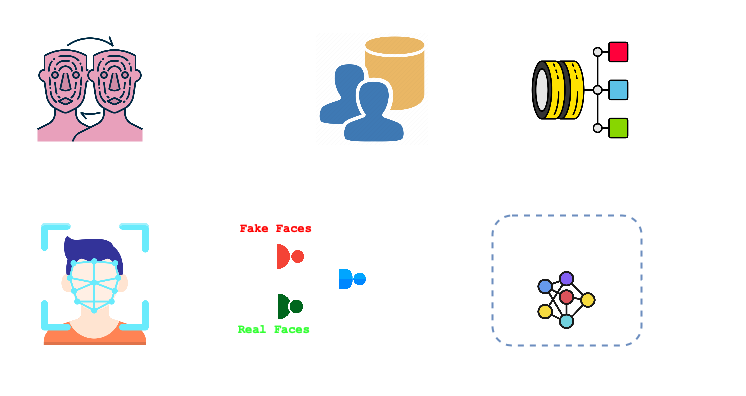

# 🛠️ 2. FEATURE EXTRACTION

## 2.1 Ottenimento dei Bounding Box
Nel paper del dataset di OpenForensics ([Disponibile al link](https://github.com/ltnghia/openforensics)) gli autori hanno progettato un’intera pipeline di annotazione _Face‐Wise Multi-Task_ che, oltre a etichettare ogni faccia con la categoria di manipolazione, include anche il **rilevamento della sua posizione** tramite l'utilizzo dei _bounding box_. In pratica, dopo aver selezionato le immagini con volti reali (prelevate da **Google Open Images**) e aver effettuato la sintesi dei volti falsificati tramite dei modelli di GAN (o Generative Adversarial Network), viene applicato un modulo di ispezione della manipolabilità che determina quali volti possano essere manipolati. 

Una volta estratto il volto, vengono calcolati **68 punti di riferimento** (o _landmark_) che consentono di definire in maniera precisa il contorno della faccia; questi landmark, unitamente a una maschera ottenuta tramite tecniche come il **Poisson blending** e **algoritmi di adattamento cromatico**, permettono di generare un bounding box accurato attorno al volto. Il risultato finale – assieme ad altre annotazioni quali la maschera di segmentazione e il confine della manipolazione – viene salvato in file `*_poly.json` in stile **COCO**, garantendo così un’annotazione ricca e multi-scopo per ciascuna faccia.

<div align="center">
  
  <p> Deepfake Detection Project using the OpenForensics dataset </p>
</div>

### 2.1.1 Metodologia di estrazione dei volti
Per estrarre i volti (sia reali che manipolati) dal dataset OpenForensics, abbiamo adottato un approccio basato sul formato COCO per le annotazioni. In particolare, lo script si occupa di creare le cartelle di output, leggere i vari file `*_poly.json`, elaborare le annotazioni, estrarre i volti e salvarli successivamente.

### 2.1.2 Creazione delle cartelle di output
Lo script crea dinamicamente due cartelle, `real` e `fake`, all'interno della directory di output, in cui vengono salvati i volti estratti.
```python
real_dir = os.path.join(output_root, "real")
fake_dir = os.path.join(output_root, "fake")
os.makedirs(real_dir, exist_ok=True)
os.makedirs(fake_dir, exist_ok=True)
```

### 2.1.3 Lettura del file *_poly.json
Viene caricato il file JSON (ad esempio, `Train_poly.json`, `Val_poly.json`, etc.) che segue la struttura **COCO** (già descritta in precedenza). Da questo file viene creata una mappa che associa ogni image_id al corrispondente file_name.
```python
with open(json_path, 'r') as f:
    data = json.load(f)

# Mappa image_id -> file_name
images_info = {img["id"]: img["file_name"] for img in data["images"]}
```

### 2.1.4 Elaborazione delle annotazioni
Per ogni annotazione, lo script estrae il bounding box, specificato come `[x, y, w, h]`, e calcola le coordinate del rettangolo da utilizzare per il ritaglio. È importante notare che le coordinate dei bounding box, utilizzate per l'estrazione dei volti, sono state fornite direttamente dagli autori del dataset tramite i file `*_.poly` (precedentemente descritti). Queste annotazioni garantiscono una rappresentazione accurata delle regioni contenenti i volti, facilitando l'estrazione corretta dei volti manipolati e reali.
```python
for ann in data["annotations"]:
    image_id = ann["image_id"]
    category_id = ann["category_id"]
    x, y, w, h = ann["bbox"]

    # Calcola le coordinate del rettangolo
    x1, y1 = int(x), int(y)
    x2, y2 = int(x + w), int(y + h)
```

### 2.1.5 Estrazione e salvataggio del volto
L'immagine viene letta con **OpenCV**, e tramite le **coordinate del bounding box** si estrae il volto. In base alla categoria (0 per `Real`, 1 per `Fake`), il volto viene salvato nella cartella appropriata con un nome file che include un indice progressivo per evitare conflitti.
```python
# Verifica se l'immagine esiste e leggila
if image_id in images_info:
    file_name = os.path.basename(images_info[image_id])
    img_path = os.path.join(images_root, image_subdir, file_name)
    
    if os.path.isfile(img_path):
        image = cv2.imread(img_path)
        if image is not None:
            cropped_face = image[y1:y2, x1:x2]
            label_str = "real" if category_id == 0 else "fake"
            face_filename = f"{os.path.splitext(file_name)[0]}_{face_count}.jpg"
            save_path = os.path.join(real_dir if category_id == 0 else fake_dir, face_filename)
            cv2.imwrite(save_path, cropped_face)
            face_count += 1
```

---

## 2.2 Validazione della qualità delle annotazioni
La qualità delle annotazioni nel dataset **OpenForensics** non è stata valutata mediante una singola metrica automatizzata, ma attraverso un **approccio misto che combina verifiche manuali e confronti con le annotazioni di riferimento**. In particolare, all'interno del paper, possiamo notare una prima revisione visiva manuale e successivamente un confronto con **ground truth** associato a **studi di user evaluation**.

### 3.5.1 Revisione Visiva Manuale
Gli autori hanno effettuato controlli manuali sui _bounding box_ e sulle _maschere di segmentazione_, verificando che le annotazioni riflettessero accuratamente le regioni contenenti i volti. Questo processo ha permesso di identificare e correggere eventuali errori, soprattutto in casi di volti parzialmente occlusi o con pose non convenzionali.

### 3.5.2 Confronto con Ground Truth e Studi di User Evaluation
In aggiunta, è stato condotto un user study per valutare la qualità visiva complessiva del dataset. I partecipanti hanno espresso un punteggio (o **Mean Opinion Score**, MOS) sulla percezione realistica delle annotazioni, confermando che i bounding box, le maschere e i landmark erano di alta qualità e ben allineati con i volti reali o manipolati. Questa valutazione qualitativa ha integrato la _revisione manuale_, garantendo l'affidabilità delle annotazioni fornite dai file `*_poly.json`.
