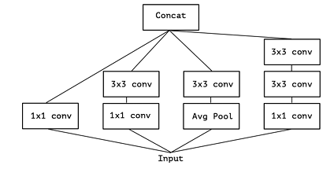

# Custom Network Architectures: MobileNet e Xception
Questo documento fornisce una panoramica approfondita di due reti neurali custom, MobileNet e Xception, analizzandone in dettaglio le architetture e i principi costitutivi. Entrambe le architetture sfruttano il concetto di convoluzioni separabili in profondità per raggiungere un compromesso ottimale tra efficienza computazionale e accuratezza, sebbene siano state progettate per scopi e applicazioni differenti.

## Mobilenet
MobileNet is a suite of highly efficient convolutional neural network architectures specifically designed for mobile and embedded vision applications. Its key innovation is the use of depthwise separable convolutions—a type of factorized convolution that splits a standard convolution into two separate operations. In the first stage, the depthwise convolution applies a single filter to each input channel, effectively isolating channel-specific features. In the second stage, the pointwise convolution (a 1×1 convolution) combines these individual outputs to form a new set of features. This two-step process replaces the traditional one-step convolution that both filters and combines inputs, leading to a significant reduction in computational cost and model size without a substantial loss in accuracy.
The following image shows the difference between 
- Standard convolutional layer with batch norm and ReLU on the left.
- Depth wise Separable convolutions with Depthwise
 and Pointwise layers followed by batch norm and ReLU.

  

MobileNet distinguishes itself with its remarkable flexibility. It introduces two global hyperparameters—the width multiplier and the resolution multiplier—which allow developers to fine-tune the trade-off between accuracy, latency, and model size. This adaptability enables the network to be scaled down for resource-constrained environments while still maintaining competitive performance on tasks like image classification, object detection, and beyond.

## Xception
Xception [Xception: Deep Learning with Depthwise Separable Convolutions Franc¸ois Chollet] is a convolutional neural network architecture that takes the idea of depthwise separable convolutions to its extreme. Instead of relying on complex inception modules, Xception completely decouples the learning of spatial and cross-channel correlations. This is done in two simple steps: first, a depthwise convolution independently extracts spatial features from each channel; then, a pointwise (1×1) convolution fuses these features across channels. This “extreme” formulation (hence the name Xception), short for “Extreme Inception”—leads to a more efficient use of parameters.
A convolution layer attempts to learn filters in a 3D space, with 2 spatial dimensions (width and height) and a channel dimension; thus a single convolution kernel is tasked with simultaneously mapping cross-channel correlations and spatial correlations. This idea behind the Inception module is to make this process easier and more efficient by explicitly factoring it into a series of operations that would independently look at cross-channel correlations and at spatial correlations. The typical Inception module first looks at cross channel correlations via a set of 1x1 convolutions, mapping  the input data into 3 or 4 separate spaces that are smaller than the original input space, and then maps all correlations in these smaller 3D spaces, via regular 3x3 or 5x5 convolutions.

  

  

An in depth view of how the Xception model can be used is seen in the paper done by R. Helaly et al. [https://ieeexplore.ieee.org/stamp/stamp.jsp?tp=&arnumber=9329302&isnumber=9329288]

