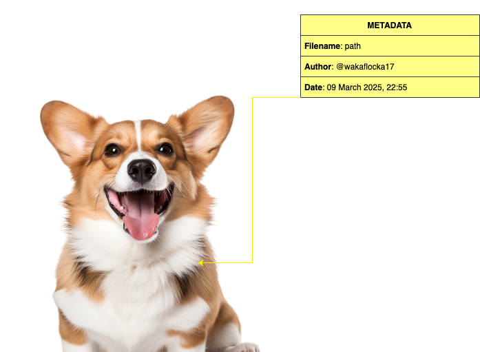
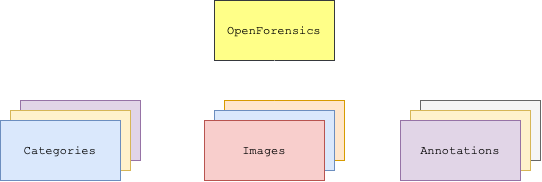

# 📊 3. METADATA ANALYSIS
<div align="center">
  
</div>

---

## 3.1 Descrizione Generale del Dataset
Il dataset **OpenForensics** rappresenta una delle più grandi raccolte di immagini reali e manipulate, specificamente progettata per compiti di rilevazione e segmentazione di deepfake multi-faccia in ambienti reali (o _In-The-Wild_). Il suo obiettivo è quello di superare le limitazioni dei dataset esistenti, che spesso contengono immagini a _sfondo uniforme_, con una _singola faccia_ e _scenari poco rappresentativi_ della complessità reale.


Questo dataset segue la tipologia di formato **COCO** (o _Common Objects in Context_), che altro non è che uno standard ampiamente adottato nella branca della Computer Vision per organizzare e annotare dati destinati a compiti come il rilevamento oggetti, la segmentazione e il riconoscimento di punti chiave (o keypoints). Infatti, nel nostro caso specifico, il dataset in analisi è organizzato come segue:
<div align="center">
  
</div>

> [!NOTE]
> Più informazioni sulla tipologia di formato **COCO**, del dataset **Openforensic**, è possibile trovarle al seguente link: https://www.immersivelimit.com/tutorials/create-coco-annotations-from-scratch/#coco-dataset-format

---

## 3.2 Caratteristiche principali
Tra le molteplici caratteristiche che contraddistinguono il dataset OpenForensics, spiccano alcuni aspetti fondamentali:

### 3.2.1 Scalabilità e Dimensioni
Il dataset **Openforensics** è composto da _115.325 immagini non ristrette_, che contengono complessivamente circa _334.000 volti_. Queste immagini sono state raccolte da fonti diverse, come ad esempio **Google Open Images**, garantendo così una notevole varietà di contesti scenici, condizioni di illuminazione e risoluzioni. Questa diversità permette di poter addestrare dei modelli robusti, che siano capaci di operare in ambienti reali e complessi.

### 3.2.2 Annotazioni Ricche e Multi-Task
Ogni volto presente nelle immagini è annotato in maniera estremamente dettagliata. Le annotazioni includono la categoria di **_forgery_** (che indica se il volto sia reale o manipolato), le **_coordinate della bounding box_**, la **_maschera di segmentazione_**, i **_contorni della manipolazione_** e i **_landmark facciali_**. Queste informazioni non solo supportano i compiti di classificazione (come nel nostro caso, la rilevazione dei deepfake), ma sono fondamentali anche per attività di _localizzazione_ e _segmentazione_, offrendo un'ampia base per sviluppi multi-task.

### 3.2.3 Diversità degli Scenari
Uno degli aspetti distintivi del dataset è la **_varietà degli scenari reali_**. Le immagini includono sia ambienti indoor che outdoor, volti con differenti dimensioni, orientamenti e condizioni di occlusione. Il processo di sintesi dei volti manipolati, che impiega tecniche avanzate come l’utilizzo di _GAN_ (o Generative Adversarial Network), _Poisson blending_ e l’_adattamento del colore_, consente di ottenere immagini ad alta risoluzione e qualità visiva, integrandosi naturalmente nei contesti originali.

### 3.2.4 Augmentazioni per la Sfida Reale
Per replicare le condizioni reali, il dataset include un sottoinsieme denominato `Test-Challenge`. In questo sottoinsieme vengono applicate numerose perturbazioni e trasformazioni, quali _modifiche di colore_, _corruzione_, _distorsioni_ e _effetti esterni_ (come ad esempio nebbia, neve e pioggia). Queste augmentazioni **aumentano la variabilità delle immagini**, mettendo alla prova la _robustezza dei metodi di rilevazione e segmentazione_.

---

## 3.3 Struttura dei File di Metadati (*_poly.json)
Il file `*_poly.json` per ogni split del dataset è strutturato come segue:
### 3.3.1 Categories
> [!NOTE]
> 💡 La sezione `categories` contiene le categorie delle classi (ad es. `Real` e `Fake`) con un identificativo.
>```json
>    "categories": [
>        {
>            "id": 0,
>            "name": "Real"
>        },
>        {
>            "id": 1,
>            "name": "Fake"
>        }
>```

### 3.3.2 Images
> [!NOTE]  
>💡 La sezione `images` è un array di oggetti, ognuno dei quali rappresenta un'immagine e include informazioni quali:
>  - `id`: identificativo univoco dell'immagine;
>  - `file_name`: percorso relativo o nome del file;
>  - `width` e `height`: dimensioni dell'immagine.
> ```json
>    "images": [
>        {
>            "id": 0,
>            "file_name": "Images/Test-Challenge/f80d795aa7.jpg",
>            "width": 1024,
>            "height": 768
>        },
>        {
>            "id": 1,
>            "file_name": "Images/Test-Challenge/d59690204c.jpg",
>            "width": 1024,
>            "height": 683
>        },
>        {
>            "id": 2,
>            "file_name": "Images/Test-Challenge/ea1488d8e9.jpg",
>            "width": 1024,
>            "height": 576
>        },
>        {
>            "id": 3,
>            "file_name": "Images/Test-Challenge/ac55ad6f33.jpg",
>            "width": 318,
>            "height": 1024
>        },
>        // ...other images...
>    ],
> ```

### 3.3.3 Annotations
> [!NOTE]  
> 💡 La sezione `annotations` è un array di annotazioni, dove ogni annotazione corrisponde a un volto presente in una delle immagini, e include:
>  - `id`: identificativo dell'annotazione;
>  - `image_id`: riferimento all'immagine associata;
>  - `iscrowd`: flag per indicare se l'annotazione rappresenta un gruppo di volti;
>  - `area`: area dell'annotazione;
>  - `category_id`: identificativo della categoria (0 per "Real", 1 per "Fake");
>  - `bbox`: bounding box, specificata come `[x_min, y_min, width, height]` (o come `[x_min, y_min, x_max, y_max]` a seconda della convenzione);
>  - `segmentation`: la maschera di segmentazione, solitamente rappresentata come un array di coordinate che definiscono un poligono;
>```json
>    "annotations": [
>        {
>            "id": 795,
>            "image_id": 364,
>            "iscrowd": 0,
>            "area": 127378,
>            "category_id": 1,
>            "bbox": [244, 112, 354, 558],
>            "segmentation": [
>                [
>                    354, 223, 352, 225, 350, 224, 349, 226, 346, 226,
>                    341, 225, 336, 227, 333, 227, 330, 228, 218, [...]
>                ]
>            ]
>        }
>        // ...other annotations...
>    ]
>```

### 3.3.4 Esempio di *_poly.json completo
> [!NOTE]  
> 💡 Un esempio concreto di struttura è il seguente:
>```json
>{
>    "categories": [
>        {
>            "id": 0,
>            "name": "Real"
>        },
>        {
>            "id": 1,
>            "name": "Fake"
>        }
>    ],
>    "images": [
>        {
>            "id": 0,
>            "file_name": "Images/Test-Challenge/f80d795aa7.jpg",
>            "width": 1024,
>            "height": 768
>        },
>        {
>            "id": 1,
>            "file_name": "Images/Test-Challenge/d59690204c.jpg",
>            "width": 1024,
>            "height": 683
>        },
>        {
>            "id": 2,
>            "file_name": "Images/Test-Challenge/ea1488d8e9.jpg",
>            "width": 1024,
>            "height": 576
>        },
>        {
>            "id": 3,
>            "file_name": "Images/Test-Challenge/ac55ad6f33.jpg",
>            "width": 318,
>            "height": 1024
>        },
>        // ...other images...
>    ],
>    "annotations": [
>        {
>            "id": 795,
>            "image_id": 364,
>            "iscrowd": 0,
>            "area": 127378,
>            "category_id": 1,
>            "bbox": [244, 112, 354, 558],
>            "segmentation": [
>                [
>                    354, 223, 352, 225, 350, 224, 349, 226, 346, 226,
>                    341, 225, 336, 227, 333, 227, 330, 228, 218, [...]
>                ]
>            ]
>        }
>        // ...other annotations...
>    ]
> }
> ```
