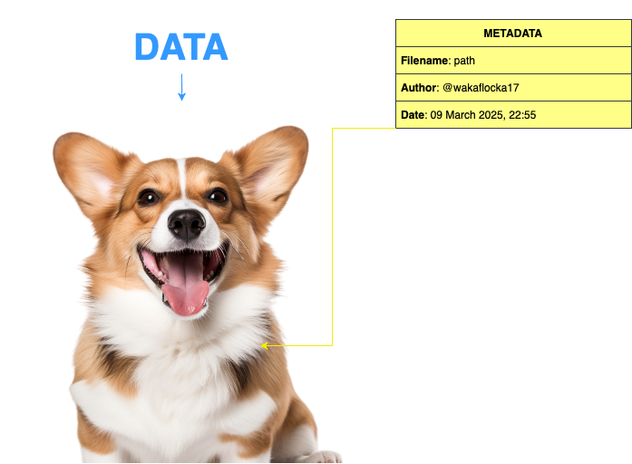

# 📊 3. METADATA ANALYSIS
<div align="center">
  
</div>

---

## 3.1 Descrizione Generale del Dataset
Il dataset OpenForensics rappresenta una delle più grandi raccolte di immagini reali e manipulate, specificamente progettata per affrontare le sfide della rilevazione e segmentazione di deepfake multi-faccia in ambienti reali ("in-the-wild"). Il suo obiettivo è quello di superare le limitazioni dei dataset esistenti, che spesso contengono immagini a sfondo uniforme, con una singola faccia e scenari poco rappresentativi della complessità reale.

---

## 3.2 Caratteristiche principali
Tra le molteplici caratteristiche che contraddistinguono il dataset OpenForensics, spiccano alcuni aspetti fondamentali:

### 3.2.1 Scalabilità e Dimensioni
Il dataset è composto da 115.325 immagini non ristrette, che contengono complessivamente circa 334.000 volti. Queste immagini sono state raccolte da fonti diverse, come ad esempio Google Open Images, garantendo così una notevole varietà di contesti scenici, condizioni di illuminazione e risoluzioni. Questa diversità permette di addestrare modelli robusti, capaci di operare in ambienti reali e complessi.

### 3.2.2 Annotazioni Ricche e Multi-Task
Ogni volto presente nelle immagini è annotato in maniera estremamente dettagliata. Le annotazioni includono la categoria di forgery (se il volto è reale o manipolato), le coordinate della bounding box, la maschera di segmentazione, i contorni della manipolazione e i landmark facciali. Queste informazioni non solo supportano i compiti di classificazione (rilevazione dei deepfake), ma sono fondamentali anche per attività di localizzazione e segmentazione, offrendo un'ampia base per sviluppi multi-task.

### 3.2.3 Diversità degli Scenari
Uno degli aspetti distintivi del dataset è la varietà degli scenari reali. Le immagini includono sia ambienti indoor che outdoor, volti con differenti dimensioni, orientamenti e condizioni di occlusione. Il processo di sintesi dei volti manipolati, che impiega tecniche avanzate come l’uso di GAN, Poisson blending e l’adattamento del colore, consente di ottenere immagini ad alta risoluzione e qualità visiva, integrandosi naturalmente nei contesti originali.

### 3.2.4 Augmentazioni per la Sfida Reale
Per replicare le condizioni reali, il dataset include un sottoinsieme denominato "Test-Challenge". In questo sottoinsieme vengono applicate numerose perturbazioni e trasformazioni, quali modifiche di colore, corruzione, distorsioni e effetti esterni (come nebbia, neve e pioggia). Queste augmentazioni aumentano la variabilità delle immagini, mettendo alla prova la robustezza dei metodi di rilevazione e segmentazione.

---

## 3.3 Struttura dei File di Metadati (poly.json)
Il file JSON per ogni split del dataset è strutturato come segue:
### 3.3.1 Categories
> [!NOTE]
> 💡 La sezione `categories` contiene le categorie delle classi (ad es. "Real" e "Fake") con un identificativo.
>```json
>    "categories": [
>        {
>            "id": 0,
>            "name": "Real"
>        },
>        {
>            "id": 1,
>            "name": "Fake"
>        }
>```

### 3.3.2 Images
> [!NOTE]  
>💡 La sezione `images` è un array di oggetti, ognuno dei quali rappresenta un'immagine e include informazioni quali:
>  - `id`: identificativo univoco dell'immagine;
>  - `file_name`: percorso relativo o nome del file;
>  - `width` e `height`: dimensioni dell'immagine.
> ```json
>    "images": [
>        {
>            "id": 0,
>            "file_name": "Images/Test-Challenge/f80d795aa7.jpg",
>            "width": 1024,
>            "height": 768
>        },
>        {
>            "id": 1,
>            "file_name": "Images/Test-Challenge/d59690204c.jpg",
>            "width": 1024,
>            "height": 683
>        },
>        {
>            "id": 2,
>            "file_name": "Images/Test-Challenge/ea1488d8e9.jpg",
>            "width": 1024,
>            "height": 576
>        },
>        {
>            "id": 3,
>            "file_name": "Images/Test-Challenge/ac55ad6f33.jpg",
>            "width": 318,
>            "height": 1024
>        },
>        // ...other images...
>    ],
> ```

### 3.3.3 Annotations
> [!NOTE]  
> 💡 La sezione `annotations` è un array di annotazioni, dove ogni annotazione corrisponde a un volto presente in una delle immagini, e include:
>  - `id`: identificativo dell'annotazione;
>  - `image_id`: riferimento all'immagine associata;
>  - `iscrowd`: flag per indicare se l'annotazione rappresenta un gruppo di volti;
>  - `area`: area dell'annotazione;
>  - `category_id`: identificativo della categoria (0 per "Real", 1 per "Fake");
>  - `bbox`: bounding box, specificata come `[x_min, y_min, width, height]` (o come `[x_min, y_min, x_max, y_max]` a seconda della convenzione);
>  - `segmentation`: la maschera di segmentazione, solitamente rappresentata come un array di coordinate che definiscono un poligono;
>```json
>    "annotations": [
>        {
>            "id": 795,
>            "image_id": 364,
>            "iscrowd": 0,
>            "area": 127378,
>            "category_id": 1,
>            "bbox": [244, 112, 354, 558],
>            "segmentation": [
>                [
>                    354, 223, 352, 225, 350, 224, 349, 226, 346, 226,
>                    341, 225, 336, 227, 333, 227, 330, 228, 218, [...]
>                ]
>            ]
>        }
>        // ...other annotations...
>    ]
>```

### 3.3.4 Esempio di *_poly.json completo
> [!NOTE]  
> 💡 Un esempio concreto di struttura è il seguente:
>```json
>{
>    "categories": [
>        {
>            "id": 0,
>            "name": "Real"
>        },
>        {
>            "id": 1,
>            "name": "Fake"
>        }
>    ],
>    "images": [
>        {
>            "id": 0,
>            "file_name": "Images/Test-Challenge/f80d795aa7.jpg",
>            "width": 1024,
>            "height": 768
>        },
>        {
>            "id": 1,
>            "file_name": "Images/Test-Challenge/d59690204c.jpg",
>            "width": 1024,
>            "height": 683
>        },
>        {
>            "id": 2,
>            "file_name": "Images/Test-Challenge/ea1488d8e9.jpg",
>            "width": 1024,
>            "height": 576
>        },
>        {
>            "id": 3,
>            "file_name": "Images/Test-Challenge/ac55ad6f33.jpg",
>            "width": 318,
>            "height": 1024
>        },
>        // ...other images...
>    ],
>    "annotations": [
>        {
>            "id": 795,
>            "image_id": 364,
>            "iscrowd": 0,
>            "area": 127378,
>            "category_id": 1,
>            "bbox": [244, 112, 354, 558],
>            "segmentation": [
>                [
>                    354, 223, 352, 225, 350, 224, 349, 226, 346, 226,
>                    341, 225, 336, 227, 333, 227, 330, 228, 218, [...]
>                ]
>            ]
>        }
>        // ...other annotations...
>    ]
> }
> ```

---

## 3.4 Metodologia di estrazione dei volti
Per estrarre i volti (sia reali che manipolati) dal dataset OpenForensics, abbiamo adottato un approccio basato sul formato COCO per le annotazioni. In particolare, lo script si occupa di creare le cartelle di output, leggere i vari file `*_poly.json`, elaborare le annotazioni, estrarre i volti e salvarli successivamente.

### 3.4.1 Creazione delle cartelle di output
Lo script crea dinamicamente due cartelle, `real` e `fake`, all'interno della directory di output, in cui vengono salvati i volti estratti.
```python
real_dir = os.path.join(output_root, "real")
fake_dir = os.path.join(output_root, "fake")
os.makedirs(real_dir, exist_ok=True)
os.makedirs(fake_dir, exist_ok=True)
```

### 3.4.2 Lettura del file *_poly.json
Viene caricato il file JSON (ad esempio, Train_poly.json, Val_poly.json, etc.) che segue la struttura **COCO**. Da questo file viene creata una mappa che associa ogni image_id al corrispondente file_name.
```python
with open(json_path, 'r') as f:
    data = json.load(f)

# Mappa image_id -> file_name
images_info = {img["id"]: img["file_name"] for img in data["images"]}
```

### 3.4.3 Elaborazione delle annotazioni
Per ogni annotazione, lo script estrae il bounding box, specificato come `[x, y, w, h]`, e calcola le coordinate del rettangolo da utilizzare per il ritaglio. È importante notare che le coordinate dei bounding box, utilizzate per l'estrazione dei volti, sono state fornite direttamente dagli autori del dataset tramite i file .poly (precedentemente descritti). Queste annotazioni garantiscono una rappresentazione accurata delle regioni contenenti i volti, facilitando l'estrazione corretta dei volti manipolati e reali.
```python
for ann in data["annotations"]:
    image_id = ann["image_id"]
    category_id = ann["category_id"]
    x, y, w, h = ann["bbox"]

    # Calcola le coordinate del rettangolo
    x1, y1 = int(x), int(y)
    x2, y2 = int(x + w), int(y + h)
```

### 3.4.4 Estrazione e salvataggio del volto
L'immagine viene letta con OpenCV, e tramite le coordinate del bounding box si estrae il volto. In base alla categoria (0 per `Real`, 1 per `Fake`), il volto viene salvato nella cartella appropriata con un nome file che include un indice progressivo per evitare conflitti.
```python
# Verifica se l'immagine esiste e leggila
if image_id in images_info:
    file_name = os.path.basename(images_info[image_id])
    img_path = os.path.join(images_root, image_subdir, file_name)
    
    if os.path.isfile(img_path):
        image = cv2.imread(img_path)
        if image is not None:
            cropped_face = image[y1:y2, x1:x2]
            label_str = "real" if category_id == 0 else "fake"
            face_filename = f"{os.path.splitext(file_name)[0]}_{face_count}.jpg"
            save_path = os.path.join(real_dir if category_id == 0 else fake_dir, face_filename)
            cv2.imwrite(save_path, cropped_face)
            face_count += 1
```

---

## 3.5 Validazione della qualità delle annotazioni
La qualità delle annotazioni nel dataset OpenForensics non è stata valutata mediante una singola metrica automatizzata, ma attraverso un approccio misto che combina verifiche manuali e confronti con annotazioni di riferimento. In particolare, possiamo notare una revisione visiva manuale e un confronto con ground truth + studi di user evaluation.

### 3.5.1 Revisione Visiva Manuale
Gli autori hanno effettuato controlli manuali sui bounding box e sulle maschere di segmentazione, verificando che le annotazioni riflettessero accuratamente le regioni contenenti i volti. Questo processo ha permesso di identificare e correggere eventuali errori, soprattutto in casi di volti parzialmente occlusi o con pose non convenzionali.

### 3.5.2 Confronto con Ground Truth e Studi di User Evaluation
In aggiunta, è stato condotto un user study per valutare la qualità visiva complessiva del dataset. I partecipanti hanno espresso un punteggio (MOS) sulla percezione realistica delle annotazioni, confermando che i bounding box, le maschere e i landmark erano di alta qualità e ben allineati con i volti reali o manipolati. Questa valutazione qualitativa ha integrato la revisione manuale, garantendo l'affidabilità delle annotazioni fornite dai file .poly.

Questi metodi combinati hanno permesso agli autori di assicurare che le annotazioni siano sufficientemente accurate per essere utilizzate nelle successive fasi di addestramento e benchmarking dei modelli per la rilevazione e segmentazione dei deepfake.
