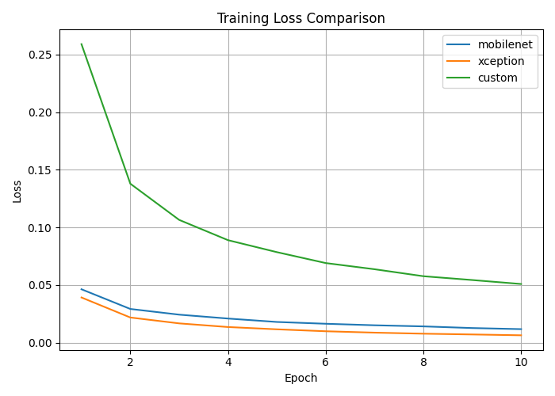
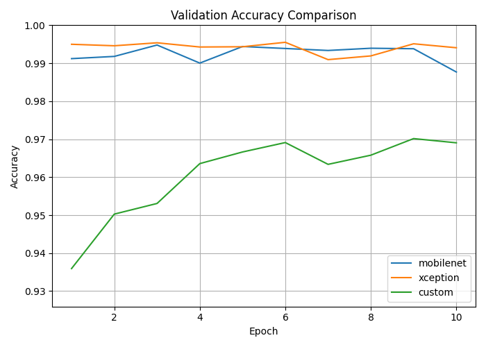

# 🔍 6. ANALYSIS AND EXPERIMENTAL RESULTS
For all experiments we used three different networks, previously mentioned, which are: **MobileNet**, **Xception** and our own **CNN Custom**.

## 6.1 MobileNet and Xception
> [!NOTE]
> The fine-tuning of **Xception**, with our HyperParameters and a M4 Pro Macbook, took 5 hours and 30 minutes. Instead the fine-tuning of **MobileNet-v2**, with the same enviroment, took 1 hour and 40 minutes in total.

### 6.1.1 Evaluation results on Test-Dev
On the **Test-Dev** dataset, both fine-tuned models achieved very good results, showing their strong ability to distinguish between real and manipulated images in relatively controlled and clean conditions.

| Model          | Accuracy | Precision | Recall | F1-Score |
|----------------|----------|-----------|--------|----------|
| MobileNet-v2     | 0.9944   | 0.9938    | 0.9965 | 0.9951   |
| Xception       | 0.9966   | 0.9966    | 0.9975 | 0.9970   |

- **Xception** achieved slightly superior performance compared to MobileNet-v2, recording almost perfect accuracy (99.66%), precision (99.66%), recall (99.75%), and F1-score (99.70%). These metrics confirm Xception capability to capture visual anomalies typical of DeepFake manipulations;

- **MobileNet-v2**, although slightly lower, also performed very well, with an accuracy of 99.44%, precision of 99.38%, recall of 99.65%, and an F1-score of 99.51%. This highlights the model's effectiveness and indicates that it also a very good option for our task.

### 6.1.2 Evaluation results on Test-Challenge
The **Test-Challenge** dataset introduces a realistic and complex scenario, including augmentations, noise, and visual distortions.

| Model          | Accuracy | Precision | Recall | F1-Score |
|----------------|----------|-----------|--------|----------|
| MobileNet-v2   | 0.8364   | 0.9670    | 0.7442 | 0.8411   |
| Xception       | 0.8023   | 0.9725    | 0.6795 | 0.8000   |

- We can see that **MobileNet-v2** has better perfomances than Xception, achieving higher accuracy (83.64% vs. 80.23%), recall (74.42% vs. 67.95%), and F1-score (84.11% vs. 80.00%). Although precision was slightly lower than Xception (96.70% vs. 97.25%), MobileNet-v2’s recall show us that it is more successful at correctly identifying deepfake images under realistic, noisy conditions;

- **Xception**, despite having slightly higher precision, demonstrated difficulty in recognizing manipulated images accurately. Its lower recall score (67.95%) indicates that it missed several challenging deepfake samples, affecting overall accuracy and F1-score.

---

## 6.2 CNN from scratch
We tested the network on two different datasets, **Test-Dev** and **Test-Challenge**. For training the CNN, we used the following hyperparameters and loss function:
```python
BATCH_SIZE = 32
EPOCHS = 10
LEARNING_RATE = 1e-4
criterion = nn.CrossEntropyLoss()
optimizer = optim.Adam(model.parameters(), lr=LEARNING_RATE)
```
We experimented with implementing data augmentation and early stopping, but the evaluation results were unsatisfactory—worse than the baseline network—so we decided not to implement these strategies in the final training.

### 6.2.1 Evaluation results on Test-Dev
The results obtained on **Test-Dev** are as follows:

| Metrics  | Results |
| ------------- | ------------- |
| Accuracy  | 0.9716  |
| Precision  | 0.9608 |
| Recall   | 0.9913 |
| F1-score    | 0.9758 |

### 6.2.2 Evaluation results on Test-Challenge
The results obtained on **Test-Challenge** are as follows:

| Metrics  | Results |
| ------------- | ------------- |
| Accuracy  | 0.8278  |
| Precision  | 0.8918 |
| Recall   | 0.8014  |
| F1-score    | 0.8441  |

### 6.2.3 GRAD-CAM Visualization
We also implemented a Grad-CAM visualization to better understand the model's decision-making process, as shown below.

Fake Image            |  Real Image
:-------------------------:|:-------------------------:
  |  

We can observe that the network primarily focuses its attention on the faces, particularly details and edges: it appears the model is identifying potential anomalies within the image. Conversely, in the second image, representing a genuine image, the network spreads its attention more evenly, covering multiple relevant areas of the image. This suggests that the network recognizes the image as real and thus processes it more globally, rather than focusing on specific details.

### 6.2.4 Training Loss and Testing Accuracy

Throughout the training process, we monitored both the loss on the training set and the classification accuracy on the validation set at each epoch.

<p align="center">
  
</p>

As shown in the previous Figure, the **MobileNet** and **Xception** models - both initialized with ImageNet-pretrained weights - demonstrated a rapid decrease in training loss, converging to near-zero values by the end of training. Instead, the **Custom CNN**, which was trained from scratch, began with a notably higher loss but improved in each epoch. As we can see in the plot, we have trained each model with 10 epochs.

<p align="center">
  
</p>

Interestingly, despite these differences in the first epochs training loss curves, all three models achieved high accuracy on the validation set (previous Figure), with values nearing or exceeding 0.95 by the final epoch. This suggests that the Custom CNN, although slower to reduce its loss, was still able to learn discriminative features effectively enough to perform well on the validation data.
